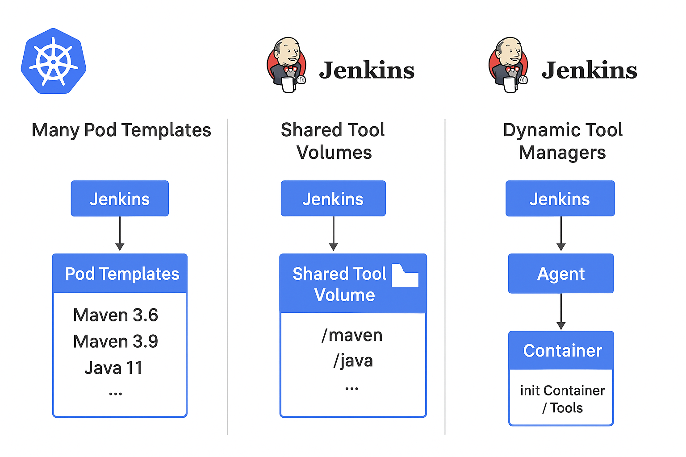

## Problem Statement
When you use the **Jenkins Kubernetes plugin** to define many pod templates (each representing a different tool version or combination), several disadvantages and operational challenges emerge:

---

### **1. Pod Template Sprawl**

* Each tool version (e.g., `maven-3.6`, `maven-3.9`, `java-17`, `java-21`) often requires its own pod template.
* This quickly leads to **dozens of definitions**, which are difficult to manage consistently.
* Inconsistent updates (e.g., base image changes, security patches) across all templates increase the maintenance burden.

---

### **2. Image Proliferation**

* Each template usually points to a different container image or combination of sidecars.
* Maintaining multiple container images for different tool versions leads to **registry bloat**, increased storage usage, and higher image maintenance costs (e.g., CVE patching across N images).

---

### **3. Scheduling & Resource Overhead**

* Each pod template may have different resource requests/limits.
* When many pod types exist, Kubernetes scheduling may fragment resources, reducing cluster efficiency.
* Cold-start latency increases because Kubernetes must pull a wide range of images, which can be large.

---

### **4. Complexity for Users (Pipeline Authors)**

* Pipeline authors must know exactly which pod template to reference (`agent { kubernetes { label 'maven-3.9' } }`).
* As versions proliferate, this becomes **cumbersome and error-prone**, especially in larger teams.

---

### **5. Lack of Versioning Strategy**

* The Kubernetes plugin itself does not enforce tool version lifecycle policies.
* Without external governance, teams may keep old pod templates “just in case,” leading to **stale environments and inconsistent builds**.

---

### **6. Limited Reusability & Flexibility**

* Pod templates are somewhat static — if you want to combine tools dynamically (e.g., Maven + JDK + Node.js), you either:

    * Predefine many combinations (combinatorial explosion), or
    * Dynamically create pod templates in pipelines (which reduces manageability and auditability).

---

### **7. Operational Risks**

* Updates (e.g., Kubernetes version upgrades, Jenkins plugin changes) may require touching every pod template.
* Debugging issues across multiple templates is time-consuming.
* Larger CasC (Configuration as Code) files become hard to maintain and validate.

---

✅ **Best Practices / Alternatives to Reduce These Issues**

* **Tool Caching + Workspace Mounts:** Mount common tool volumes (e.g., `Maven`, `Gradle`, `Java`) instead of baking every version into images.
* **Universal Base Images + Environment Managers:** Use a small set of base images with version managers (e.g., `sdkman`, `nvm`, `pyenv`) to dynamically install versions.
* **Pipeline Libraries:** Encapsulate agent logic and avoid exposing raw pod template names to end users.
* **CloudBees CI + CasC:** Use CasC to centralize pod template definitions with governance.
* **Container Build Tools:** Standardize with something like `toolchains` in Maven/Gradle or containerized build steps instead of full custom pod templates.

---

👉 In short: **the main disadvantages are sprawl, maintenance overhead, image bloat, pipeline complexity, and lack of governance** when scaling pod templates to manage many tool versions.

---

## **Comparison of Approaches for Managing Build Tools in Jenkins on Kubernetes**

| Aspect                         | Many Pod Templates                                               | Shared Tool Volumes                                                                    | Dynamic Tool Managers (e.g., Jenkins Tool Installers, Custom Init Containers)           |
| ------------------------------ | ---------------------------------------------------------------- | -------------------------------------------------------------------------------------- | --------------------------------------------------------------------------------------- |
| **Setup Complexity**           | High – each tool/version requires its own pod template           | Medium – one volume to maintain, mounted into pods                                     | Medium–High – requires scripting or configuration of tool management plugins/containers |
| **Maintainability**            | Difficult – exponential growth in pod templates for each version | Easier – centralize tools in a shared volume; updates are applied once                 | Flexible – tools can be provisioned dynamically without pod template sprawl             |
| **Scalability**                | Poor – becomes unmanageable as tool/version matrix grows         | Good – volume can be expanded and reused across jobs                                   | Good – scales with dynamic provisioning, but may add runtime overhead                   |
| **Version Management**         | Rigid – requires a pod template per version                      | Centralized but limited – multiple versions can coexist if volume structured carefully | Very Flexible – jobs request versions on demand                                         |
| **Storage Requirements**       | Spread across many container images (large image registry)       | Centralized storage (NFS, PVC, hostPath, etc.)                                         | Minimal in container images; tools downloaded/cached at runtime                         |
| **Performance**                | Good – pre-baked images start quickly                            | Good – tools available immediately if mounted                                          | Variable – first use may require download/installation, but caching mitigates           |
| **Security & Compliance**      | Harder to audit – many images to maintain/push with patches      | Easier – update shared tool repository centrally                                       | Easier – updates controlled by tool installers or base images                           |
| **Flexibility for Developers** | Low – developers limited to predefined pod templates             | Medium – developers can pick from shared toolset                                       | High – developers can declare tool versions as code (e.g., Jenkins tool config, CasC)   |
| **Operational Risks**          | High – risk of outdated or unused pod templates accumulating     | Medium – volume corruption/outage affects many builds                                  | Medium – relies on network and external repositories if not cached                      |
| **Best Use Case**              | Small, stable environments with limited tool diversity           | Medium-sized teams needing multiple tool versions centrally managed                    | Large/complex environments with frequent version changes or strict DevOps practices     |

---

## **Diagram**

The following diagram shows the different design options: 

# **Resources in this repository**

| File                                                 | Description                                                                               |  |
| ---------------------------------------------------- | ----------------------------------------------------------------------------------------- | - |
| 00-setupGKEFilestore.sh                              | create filestore in GCP                                                                   |   |
| 01-installTools.sh                                   | create a PVC and a tools-pod, installs java for testing purposes on the tools volume      |   |
| tools-volume-pvc.yml                                 | k8s resource for the PVC and the POD                                                      |   |
| Jenkinsfile-declarative-pipeline-tools-volume.groovy | Jenkins declarative Test Pipeline, uses inline pod yaml                                   |   |
| Jenkinsfile-scripted-pipeline-tools-volume.groovy    | Jenkins scripted Test Pipeline, referncess to label, allocate a pod from k8s pod template |   |
| casc-k8s-podtemplate.yaml                            | casc config for the k8s-podtemplate                                                       |   |

### Quickstart

* adjust the variables in [00-setupGKEFilestore.sh](00-setupGKEFilestore.sh) then run the script to enable the file store CSI driver in your cluster
* run [01-installTools.sh](01-installTools.sh) to install a tool (here jdk) on the volume
* run the [Jenkinsfile-declarative-pipeline-tools-volume.groovy](Jenkinsfile-declarative-pipeline-tools-volume.groovy) on your controller
* apply [casc-k8s-podtemplate.yaml](casc-k8s-podtemplate.yaml) on your Controller or Operations Center to test the [Jenkinsfile-scripted-pipeline-tools-volume.groovy](Jenkinsfile-scripted-pipeline-tools-volume.groovy)
